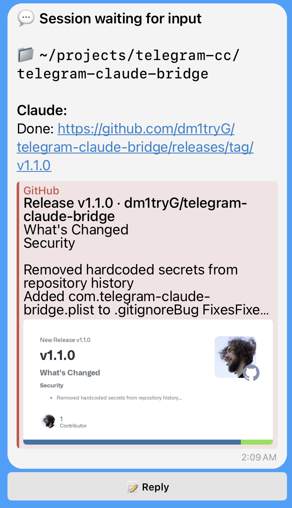

# Telegram ↔ Claude Code Permission Bridge

A daemon service that forwards Claude Code permission requests to Telegram for approval. Also supports session tracking and bidirectional communication with Claude Code.

## Architecture

```
┌─────────────────┐     ┌──────────────────────┐     ┌─────────────────┐
│   Claude Code   │────▶│   Bridge Service     │────▶│    Telegram     │
│                 │◀────│   (Python daemon)    │◀────│      Bot        │
└─────────────────┘     └──────────────────────┘     └─────────────────┘
        │                         │
        │ Hooks:                  │ In-memory state:
        │ - PermissionRequest     │ - Pending requests
        │ - SessionStart          │ - Active sessions
        │ - Notification          │
        │ - Stop                  │
        │ - SessionEnd            │
        ▼                         ▼
   stdin/stdout               FastAPI Server
   via tmux                   (REST API)
```

## Features

- **Permission Requests** — Approve/deny Claude Code actions from Telegram
- **Session Tracking** — See active Claude Code sessions with status
- **Bidirectional Input** — Send text input to Claude Code from Telegram
- **Authorization** — Bot only responds to configured chat ID



## Requirements

- Python 3.11+
- [uv](https://github.com/astral-sh/uv) package manager
- `jq` (for hook installation)
- Telegram account

## Setup

### 1. Install dependencies

```bash
cd telegram-claude-bridge
uv sync
```

Install `jq` if not present:

```bash
# macOS
brew install jq

# Ubuntu/Debian
sudo apt install jq
```

### 2. Create Telegram Bot

1. Message [@BotFather](https://t.me/botfather) on Telegram
2. Send `/newbot` and follow prompts
3. Copy the bot token

### 3. Get your Chat ID

1. Message your new bot
2. Visit `https://api.telegram.org/bot<YOUR_TOKEN>/getUpdates`
3. Find your `chat.id` in the response

### 4. Configure environment

```bash
cp .env.example .env
# Edit .env with your values
```

Required variables:

```bash
TELEGRAM_BOT_TOKEN="your-bot-token"
TELEGRAM_CHAT_ID="your-chat-id"
```

### 5. Install Claude Code hooks

```bash
./hooks/install.sh
```

This installs 5 hooks into `~/.claude/settings.json`:
- `PermissionRequest` — forwards permission requests
- `SessionStart` — notifies on new sessions
- `Notification` — forwards idle prompts
- `Stop` — tracks session stops
- `SessionEnd` — notifies on session end

### 6. Start the bridge

**Manual:**

```bash
uv run telegram-claude-bridge
```

**As macOS service (LaunchAgent):**

```bash
./install-service.sh
```

Check service status:

```bash
./status.sh
```

Uninstall service:

```bash
./uninstall-service.sh
```

### 7. Start Claude Code

For session input feature to work, start Claude Code inside tmux:

```bash
tmux new -s claude
claude
```

This allows the bridge to send your replies from Telegram directly to Claude Code.

## Usage

### Permission Requests

When Claude Code requests permission, you'll receive a Telegram message:

```
🔐 Permission Request

Tool: Bash
Command:
rm -rf node_modules

[✅ Allow]  [❌ Deny]
[✅ Allow All Session]
```

- **Allow** — Permit this single action
- **Deny** — Block this action
- **Allow All Session** — Allow this action (session-wide allowlisting not yet implemented)

### Session Input

You can send input to active Claude Code sessions:

1. Run `/sessions` to see active sessions
2. Tap **Reply** button on a session
3. Type your message and send
4. Use `/cancel` to exit reply mode

## Telegram Commands

| Command | Description |
|---------|-------------|
| `/start` | Show welcome message |
| `/status` | Show bridge status (pending requests, active sessions) |
| `/pending` | List pending permission requests |
| `/sessions` | List active Claude Code sessions |
| `/cancel` | Exit reply mode |

## API Endpoints

| Endpoint | Method | Description |
|----------|--------|-------------|
| `/health` | GET | Health check, returns `{status, pending, sessions}` |
| `/permission` | POST | Submit permission request (used by hook) |
| `/session` | POST | Submit session events (used by hooks) |

## Configuration

| Variable | Description | Default |
|----------|-------------|---------|
| `TELEGRAM_BOT_TOKEN` | Bot token from BotFather | Required |
| `TELEGRAM_CHAT_ID` | Your Telegram chat ID | Required |
| `BRIDGE_HOST` | Host to bind to | `127.0.0.1` |
| `BRIDGE_PORT` | Port to listen on | `8765` |
| `PERMISSION_TIMEOUT` | Timeout in seconds | `300` |

**Note:** Bridge URL (`http://127.0.0.1:8765`) is hardcoded in hook scripts. If you change `BRIDGE_PORT`, update the URLs in `hooks/permission_request.py` and `hooks/session_events.py`.

## Known Limitations

- **In-memory state** — Session data is lost on bridge restart
- **Allow All Session** — Currently behaves same as Allow (session-wide allowlisting not implemented)
- **Single user** — Bot only responds to one configured `TELEGRAM_CHAT_ID`
- **tmux dependency** — Session input requires Claude Code running in tmux

## Development

```bash
# Install dev dependencies
uv sync --dev

# Lint
uv run ruff check .
```

## License

MIT
